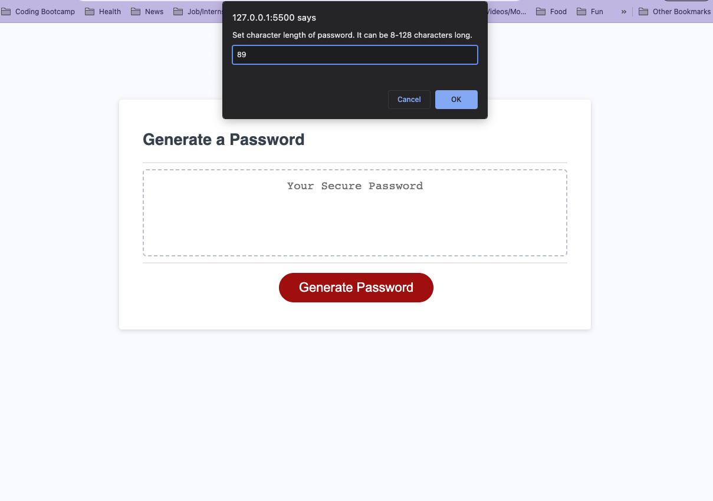
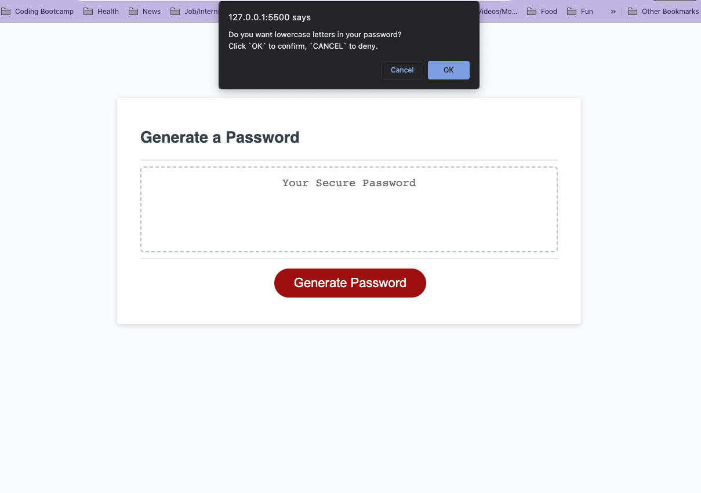
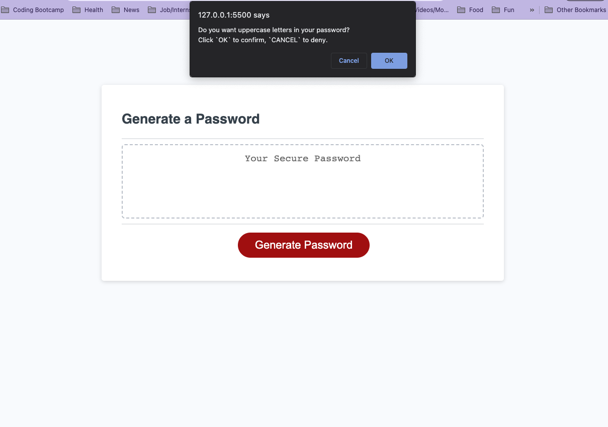
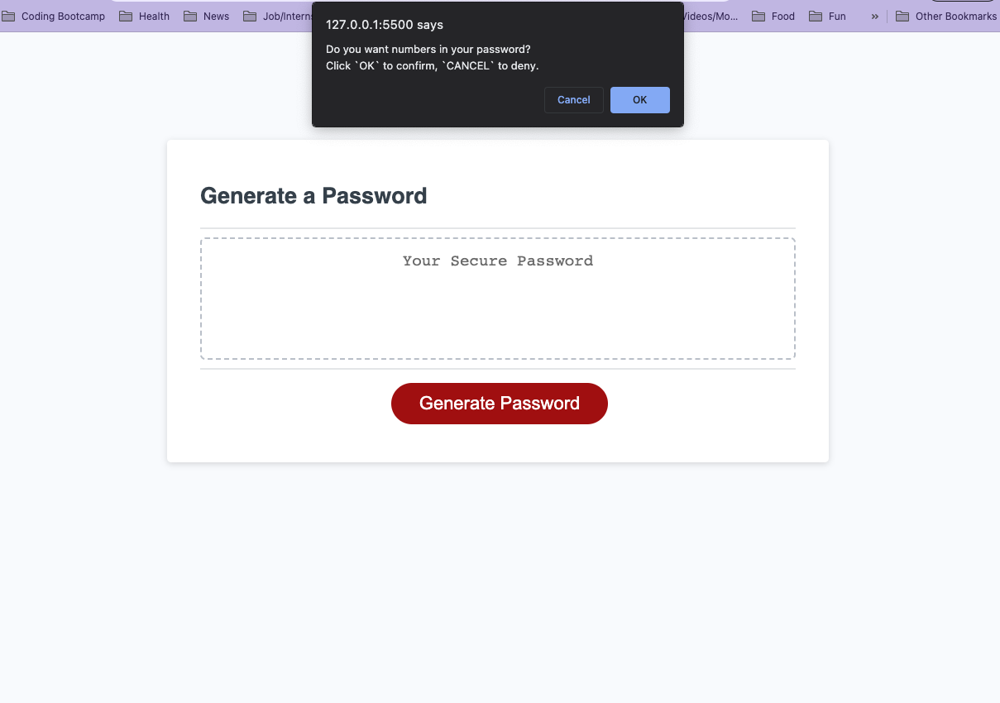
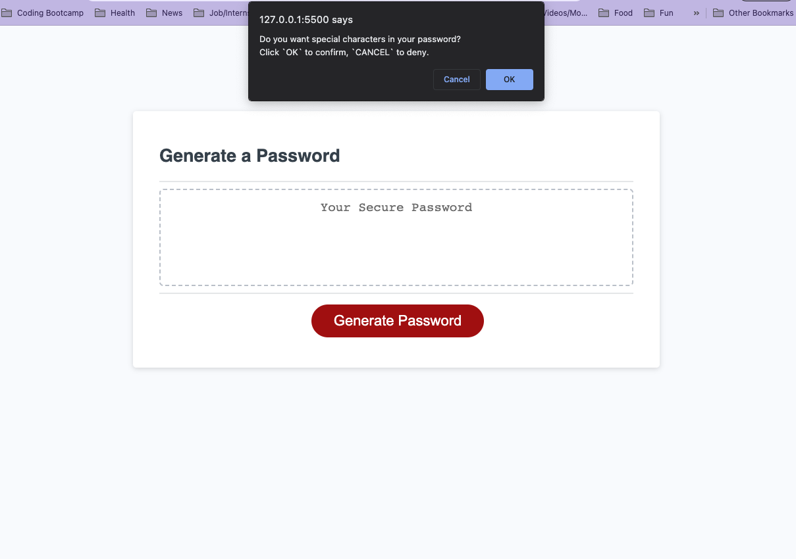
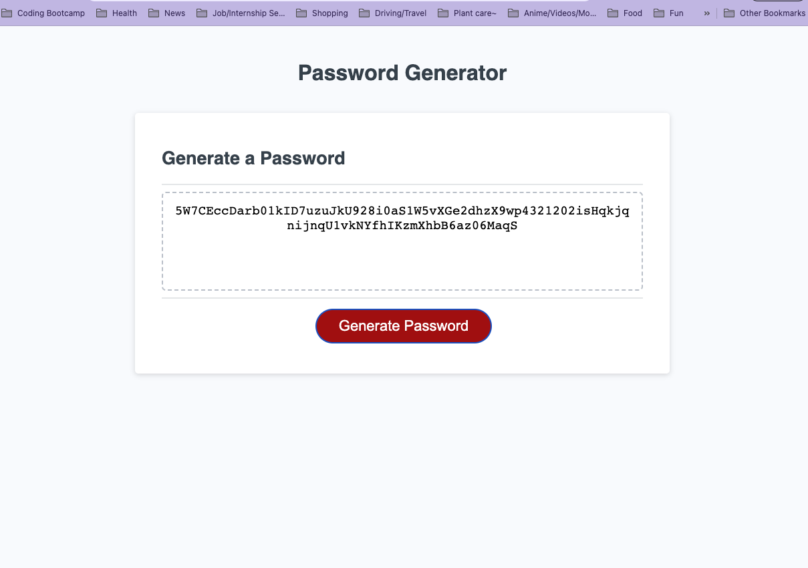

# password-generator_c3

## Description
This project is intended to help my client create a strong password using the criteria given that they enter a character length between 8-128 characters and their choice of having lowercase, uppercase, numbers, and special characters. 

## Installation

N/A

## Usage

Link to live website:
https://jrocksymphonia.github.io/password-generator_c3/

## Credits
links gathered:

the /n break on JS with prompts/alerts/confirms
https://www.codespeedy.com/how-to-add-line-breaks-in-javascript-alert/

Looking into how prompts store data
https://developer.mozilla.org/en-US/docs/Web/API/Window/prompt

Not-a-Number aka isNAN()
https://www.w3schools.com/jsref/jsref_isNaN.asp 

Password Generator Tutorial, Used it as my guide:
https://www.tutorialstonight.com/password-generator-in-javascript#writing-javascript-code-for-password-generator 

## License
Please refer to the LICENSE in the repo.

---